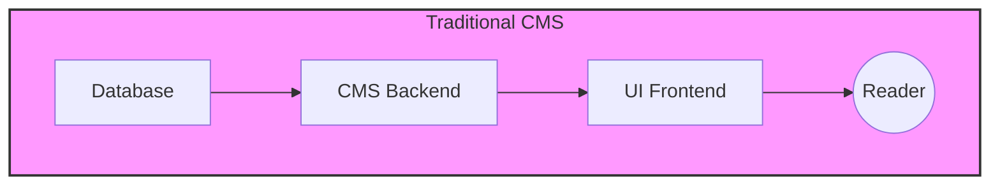
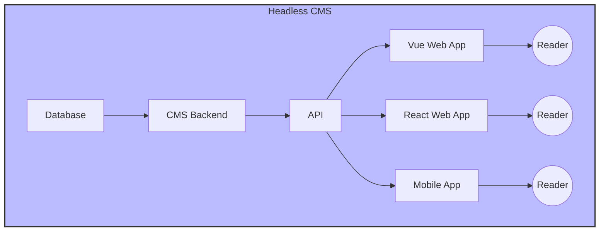

# Template for Headless CMS (Strapi)

Traditionally, if you wanted to build a website with dynamic content, you would need to implement a backend which consists of defining a data structure, creating a database and then implementing a backend that creates, reads, updates and deletes the data all while also authenticating and authorizing requests. You'd also have to create some sort of frontend to manage/administer the data (i.e. creating a blog post, editing a user profile, etc.). This is a lot of work especially if the end goal is to hand over the project to a non-technical.



A CMS (content management system) handles all the backend work for you (including the ui for managing the data) so you can focus on building the visual aspect of your project. Unlike traditional CMSs, a headless CMS does not come with a frontend. Instead, it provides an API that you can use to fetch the data and display it in your own frontend. This allows you to use any technology you want for the frontend (e.g. Vue, React, HTML + Vanilla JS, etc.) while still having a powerful backend to manage your data.



This template uses [Strapi](https://github.com/strapi/strapi) as the headless CMS solution for the following reasons:

- **Open Source**: Strapi is open source and free to use which means you can self-host it and have full control over your data.
- **Customizable**: Strapi is highly customizable and allows you to define your own data structure, create custom APIs, and even extend the admin panel.
- **Nodejs**: Strapi is built with Nodejs which allows you to leverage certain Nodejs features and libraries.
- **Community**: Strapi has a large and active community which means you can find help and resources easily.

## Usage

> [!NOTE]
> Strapi can be used in a `development` and `production` environment. The difference between the two is that in a `development` environment, you can build and modify data structures (i.e. create a content type, add a field etc.) which you cannot do in a `production` environment.

This template can be used in two different ways:

- as [nodejs application](#nodejs)
- as a [container application](#container)

### Nodejs

Pre-requisites:

- [Node.js](https://nodejs.org/en/download/) (`v22.14.0`)
- `npm` (pnpm does not work with Strapi)

```bash
# Install dependencies
npm install

# Build the admin panel
npm run build

# Start the Strapi application (in development mode)
# note: this will start the Strapi application at http://localhost:1337
npm run dev
# or
npm run start
```

### Container

This repository lets you startup a strapi instance using Docker or Docker Compose.

Pre-requisites:

- [Docker](https://www.docker.com/get-started)
- [Docker Compose](https://docs.docker.com/compose/install/)

To quickly get started with, run the following commands:

```bash
# Build the container image
docker build -t cms .

# Start the container (will listen on http://localhost:1337)
docker run \
--name cms \
-p 1337:1337 \
-e NODE_ENV=development \
-e APP_KEYS=<your-base64-app-keys> \
cms
```

- the `docker build` command builds the container image with the tag `cms` based on the [`Dockerfile`](./Dockerfile) in the root of the repository.
- the `docker run` command:
  - `--name cms` names the container `cms`
  - `-p 1337:1337` maps port `1337` of the container to port `1337` of the host machine
  - `-e NODE_ENV=development` sets the environment variable `NODE_ENV` to `development`
  - `-e APP_KEYS=<your-base64-app-keys>` sets the environment variable `APP_KEYS` to a base64 encoded string (you can generate this using the command `node -e "console.log(Buffer.from('your-secret-key').toString('base64'))"` where `your-secret-key` is a secret key of your choice)

For a more advanced setup, you can use the provided [`docker-compose.yml`](./docker-compose.yml) file to start the Strapi application with behind a reverse proxy (e.g. Nginx):

```bash
# Start the Strapi application with Docker Compose
docker-compose up
```

## Learn more

- [Resource center](https://strapi.io/resource-center) - Strapi resource center.
- [Strapi documentation](https://docs.strapi.io) - Official Strapi documentation.
- [Strapi tutorials](https://strapi.io/tutorials) - List of tutorials made by the core team and the community.
- [Strapi blog](https://strapi.io/blog) - Official Strapi blog containing articles made by the Strapi team and the community.
- [Changelog](https://strapi.io/changelog) - Find out about the Strapi product updates, new features and general improvements.
